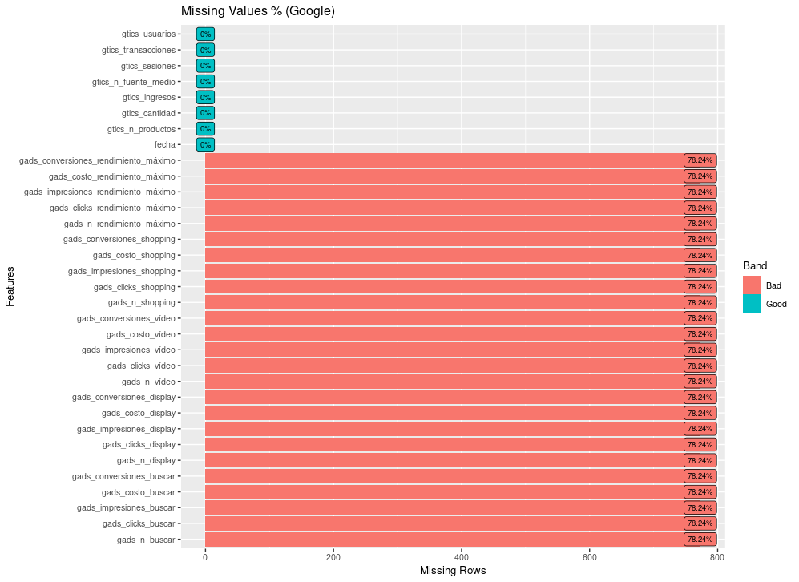
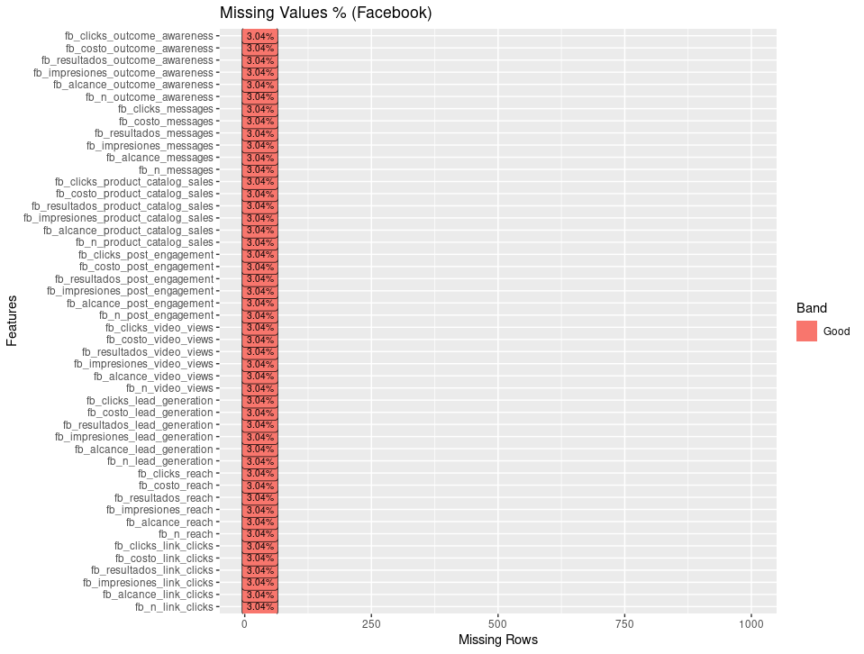

# Análisis exploratorio

Una vez que los datos individuales han sido estudiados descriptivamente de manera cruda, se procede a realizar la creación de un único conjunto de datos que centralice la información de todas las fuentes de información presentadas anteriormente. Este conjunto se crea mediante agregaciones diarias de todas las métricas reportadas originalmente, de modo que se pueda analizar posteriormente la relación entre la variable de respuesta (transacciones diarias) y el resto de información que podría servir para estimar este pronóstico.

## Nomenclatura

Para el caso de Facebook y Google Ads, las variables que se incluyen en este conjunto de datos presenta una nomenclatura particular que depende de la información que se analiza en cada columna para cada campaña. La nomenclatura es la siguiente

$$\text{origen_métrica_propósito}$$

**Donde:**

> Origen: Es la fuente de datos (Google Ads, Google Analytics, Facebook).
>
> Métrica: Hace referencia a la medición (likes, costo, alcance, conversiones, etc).
>
> Propósito: Refiere al objetivo que tiene cada campaña.

En el caso de Google Analytics, la nomenclatura es ligeramente distinta, pues no contienen información de campañas sino de resultados de las sesiones en la plataforma de Elektra. Esta nomenclatura sigue la siguiente sintaxis:

$$\text{origen_métrica}$$

Ejemplos: 

* **fb_costo_video_views:** Variable que proviene de Facebook y mide el costo invertido cada día en campañas que tenían como propósito lograr vistas mediante videos

* **gtics_transacciones:** Variable proveniente de Google Analytics que mide la cantidad de transacciones diarias.

* **gtics_n_fuente_medio:** Variable de Google Analytics que refiere al número de combinaciones distintas de fuentes/medios por los cuales se llevaron a cabo las sesiones del portal de Elektra cada día

* **fb_n_link_click:** En Facebook, es el número de campañas distintas implementadas cada día cuyo propósito es la obtención de click en un link.

___

Una vez que el conjunto de datos ha sido creado, se procede a analizar la consistencia, calidad y disponibilidad de información obtenida. A partir de este análisis se conoce la viabilidad de usar la información de cada una de las fuentes de información. 

Algunas de las principales características de interés es la distribución univariada y multivariada de cada par de características, así como las medidas de tendencia central y porcentaje de datos perdidos.

## Análisis de disponibilidad

Aunque originalmente no se observaron muchos datos faltantes cuando se realiza el análisis individual de cada fuente de información, al hacer coincidir las tablas por fechas es posible tener disparidades importantes, por lo que se realiza un análisis de datos faltantes después de observar las fechas de disponibilidad de datos:

|Fuente           |Fecha inicial  |Fecha final |
|-----------------|---------------|------------|
|Facebook Ads     |2019-10-30     |2021-11-22  |
|Google Analytics |2019-09-30     |2022-06-13  |
|Google Ads       |2021-10-31     |2022-06-02  |

Al considerar el periodo completo del 30 de septiembre de 2019 al 13 de junio de 2022, se cuenta con un volumen de datos faltantes considerable, mismo que se representa en las siguientes gráficas:

```{r}
library(tidyverse)
library(corrplot)
library(heatmaply)
library(fpp3)
library(tsibble)
library(DataExplorer)
library(forecast)
library(skimr)
library(kableExtra)

fb_agg <- fb %>%
  group_by(dia = Dia, objetivo_fb = Objetivo) %>%
  summarise(
    fb_n = n_distinct(Nombre_campaña),
    fb_alcance = sum(Alcance, na.rm = T),
    fb_impresiones = sum(Impresiones, na.rm = T),
    fb_resultados = sum(Resultados, na.rm = T),
    fb_costo = sum(Importe_gastado_USD, na.rm = T),
    fb_clicks = sum(Clics_enlace, na.rm = T),
    .groups = "drop"
  ) %>%
  pivot_wider(
    names_from = objetivo_fb,
    values_from = c("fb_n", "fb_alcance", "fb_impresiones", 
                    "fb_resultados", "fb_costo", "fb_clicks"),
    values_fill = 0,
    names_vary = "slowest"
  ) %>% 
  rename_with(tolower)
  
gads_agg <- gads %>%
  mutate_at(vars(Clics:Conversiones),
            ~as.numeric(str_replace(.x, pattern = ",", replacement = ""))) %>%
  group_by(dia = Dia, objetivo_ga = Tipo_de_campaña) %>%
  summarise(
    gads_n = n_distinct(Campaña),
    gads_clicks = sum(Clics, na.rm = T),
    gads_impresiones = sum(Impr, na.rm = T),
    gads_costo = sum(Coste, na.rm = T),
    gads_conversiones = sum(Conversiones, na.rm = T),
    .groups = "drop"
  ) %>%
  pivot_wider(
    names_from = objetivo_ga,
    values_from = c("gads_n", "gads_clicks", "gads_impresiones", 
                    "gads_costo", "gads_conversiones"),
    values_fill = 0,
    names_vary = "slowest"
  ) %>% 
  rename_with(tolower)


gticks_tr_agg <- gticks_tr %>% 
  group_by(fecha = Fecha) %>%
  summarise(
    gtics_n_fuente_medio = n_distinct(Fuente_medio),
    gtics_sesiones = sum(Sesiones, na.rm = T),
    gtics_transacciones = sum(Transacciones, na.rm = T),
    gtics_usuarios = sum(Usuarios, na.rm = T),
    .groups = "drop"
  )
  
gticks_q_agg <- gticks_q %>% 
  group_by(fecha = Fecha) %>%
  summarise(
    gtics_n_productos = n_distinct(Producto),
    gtics_cantidad = sum(Cantidad, na.rm = T),
    gtics_ingresos = sum(Ingresos, na.rm = T),
    .groups = "drop"
  )
```
 
```{r}
data <- gticks_q_agg %>% 
  left_join(gticks_tr_agg, by = "fecha") %>% 
  left_join(gads_agg, by = c("fecha" = "dia")) %>% 
  left_join(fb_agg, by = c("fecha" = "dia")) %>% 
  rename_with(~str_replace_all(.x, " ", "_"))
```


```{r, eval=FALSE, out.height='700px'}
data %>% 
  select(starts_with("fb")) %>% 
  DataExplorer::plot_missing(
    geom_label_args = list(size = 2.7),
    theme_config= list(text = element_text(size=11)),
    title = "Missing Values % (Facebook)"
  ) +
  scale_y_continuous(limits = c(0, 1000))
```

```{r echo=FALSE, fig.align='center', out.width='700pt', out.height='700pt'}

```

```{r, eval=FALSE, out.height='700px'}
data %>% 
  select(-starts_with("fb")) %>% 
  DataExplorer::plot_missing(
    geom_label_args = list(size = 2.7),
    theme_config= list(text = element_text(size=11)),
    title = "Missing Values % (Google)"
  )  +
  scale_y_continuous(limits = c(0, 1000))
```

```{r echo=FALSE, fig.align='center', out.width='700pt', out.height='700pt'}

```
 
Es importante la cantidad de datos faltantes provenientes de Google Ads, por lo que se revisará posteriormente la factibilidad de conseguir dicha información. Una manera fácil de entender la magnitud de la falta de información se logra a través del siguiente gráfico:

```{r}
data %>% 
ggplot(aes(x = fecha, y = gtics_transacciones)) +
  geom_col(fill = "red", color = "red") +
  geom_vline(xintercept = ymd("2019-10-30"), colour = "blue") +
  geom_vline(xintercept = ymd("2022-06-16"), colour = "blue") +
  geom_vline(xintercept = ymd("2021-10-31"), colour = "green") +
  geom_vline(xintercept = ymd("2022-06-13"), colour = "green") +
  scale_x_date(date_breaks = "1 month") +
  theme(axis.text.x = element_text(angle = 90, vjust = 0.5, hjust=1)) +
  labs(title = "Monto de transacciones históricas", x = "Fecha", y = "Transacciones")
```

 Las transacciones diarias están representadas por las líneas verticales rojas (Google Analytics). El periodo contenido entre las lineas azules representa la información disponible de Facebook Ads, mientras que la información contenida entre las lineas verdes corresponde a Google Ads.
 

 
::: {.infobox .note data-latex="{note}"}
**¡Toma de decisión!**

Dada esta información disponible... Se comenzará a trabajar la información disponible en el periodo del 1° de mayo de 2020 al 1° de junio de 2022, sin embargo, es áltamente deseable contar con la información completa para extraer el mayor valor de la información recolactada.
:::


## Análisis Univariado

Con el objetivo de conocer las características y comportamiento de las actividades asociadas a las ventas de Elektra mediante la plataforma de *e-commerce*, se presentan en esa sección diversos análisis estadísticos y gráficos que facilitan el entendimiento de la información que ha sido registrada en los últimos años. La variable más importante a estudiar es la respuesta que se desea pronosticar, la cual corresponde a las transacciones diarias. En un siguiente apartado se realiza el análisis de la relación entre múltiples variables.

El siguiente gráfico se trata de un histograma. Este gráfico permite conocer la cantidad de transacciones que tienen lugar por rangos, es decir, se crean 30 rangos del mismo tamaño (equidistantes) y se calcula el número de transacciones que ocurren en cada intervalo. Mediante esta visualización es factible conocer el rango de transacciones diarias que se acumulan con más frecuencia y aquellas que ocurren rara vez ya sea porque se trata de días con muy bajo o muy alto número de transacciones.

Adicionalmente, se hace uso de una transformación de estabilización de la variabilidad. Debido a que existe una gran diferencia entre los días con alto número de transacciones y el resto de días en donde ocurren bajas transacciones, los intervalos creados por el gráfico no facilitan de la mejor manera el entendimiento de la información y es por esa razón que se realiza la transformación matemática conocida como *logaritmo natural*.


```{r} 
library(patchwork)

hist_trans <- data %>% 
  filter(fecha >= "2020-05-01") %>% 
  ggplot(aes(x = gtics_transacciones)) +
  geom_histogram(color = "blue", fill = "lightblue") +
  geom_vline(aes(xintercept = median(data$gtics_transacciones), color = "Mediana")) +
  geom_vline(aes(xintercept = mean(data$gtics_transacciones), color = "Media")) +
  scale_color_manual(name = "Estadísticas", values = c("Media" = "black", "Mediana" = "red")) +
  labs(title = "Histograma de transacciones", x = "Transacciones", y = "Conteos")

hist_log_trans <- data %>% 
  filter(fecha >= "2020-05-01") %>% 
  ggplot(aes(x = log(gtics_transacciones+1))) +
  geom_histogram(color = "blue", fill = "lightblue") +
  geom_vline(aes(xintercept = log(median(data$gtics_transacciones)+1), color = "Mediana")) +
  geom_vline(aes(xintercept = log(mean(data$gtics_transacciones)+1), color = "Media")) +
  scale_color_manual(name = "Estadísticas", values = c("Media" = "black", "Mediana" = "red")) +
  labs(title = "Histograma de transacciones", subtitle =  "(Escala logarítmica)", 
       x = "Transacciones", y = "Conteos")

hist_trans / hist_log_trans
```
```{r}
stats_transacciones <- data %>% 
  filter(fecha >= "2020-05-01") %>% 
  summarise(
    total = sum(gtics_transacciones),
    `desviación estandar` = sd(gtics_transacciones),
    media = mean(gtics_transacciones, na.rm = T),
    `desviación media` = sd(gtics_transacciones, na.rm = T)/sqrt(n()),
    min = min(gtics_transacciones, na.rm = T),
    q10 = round(quantile(gtics_transacciones, probs = 0.10, na.rm = T),0),
    q25 = round(quantile(gtics_transacciones, probs = 0.25, na.rm = T),0),
    mediana = median(gtics_transacciones, na.rm = T),
    q75 = round(quantile(gtics_transacciones, probs = 0.75, na.rm = T), 0),
    q90 = round(quantile(gtics_transacciones, probs = 0.90, na.rm = T), 0),
    max = max(gtics_transacciones, na.rm = T),
    `rango intercuartil` = q75 - q25
  ) %>% 
  round(1)

stats_transacciones %>% 
  DT::datatable(
    rownames = F,
    options=list(dom="t", scrollX = TRUE)
    ) %>% 
  DT::formatRound(columns = 1, interval = 3, mark = ",", digits = 0)
```

</br>

**Interpretación**

Al analizar los estadísticos y el gráfico anterior, observamos que el periodo entre el 1° de mayo de 2020 y el 13 de junio de 2022 han ocurrido 92,758 transacciones. En promedio, cada día ocurren entre 115 y 125 transacciones. Esta media es ligeramente sesgada debido a los días en donde ocurren muchas transacciones. La mitad de días ocurren hasta 102 transacciones y la otra mitad ocurren más, sin embargo, hay días de mucha actividad. Por ejemplo, el día de mayor número de transacciones en este periodo corresponde al periodo de ventas en el "black-friday" del año 2020, en donde tienen lugar 648 transacciones. Eliminando el 10% de los días de más alta actividad y el 10% de más baja, ocurren entre 69 y 195 transacciones. 

Otra forma de analizar estos días e intervalos clave, es a través de los siguientes gráficos de *violín*, en los cuales se analiza la distribución de transacciones tanto en su escala original como en la escala logarítmica, mostrando la media, percentiles 10, 25, 50, 75, 90 y puntos que son considerados atípicos. 

```{r, out.height="400pt"} 
data_summary <- function(x) {
   m <- mean(x)
   ymin <- quantile(x, probs = 0.1) %>% unname()
   ymax <- quantile(x, probs = 0.9) %>% unname()
   return(c("y"=m,"ymin"=ymin,"ymax"=ymax))
}

violin_trans <- data %>% 
  filter(fecha >= "2020-05-01") %>% 
  ggplot(aes(x = 1, y = gtics_transacciones)) +
  geom_violin(fill = "purple") +
  geom_boxplot(width=0.1) +
  stat_summary(fun.data=data_summary, color = "red") +
  coord_flip() +
  scale_y_continuous(n.breaks = 10) +
  theme(axis.text.y=element_blank(), axis.ticks.y=element_blank()) +
  labs(title = "Distribución de transacciones", y = "Transacciones", x = "")

  
violin_log_trans <- data %>% 
  filter(fecha >= "2020-05-01") %>% 
  ggplot(aes(x = 1, y = log(gtics_transacciones+1))) +
  geom_violin(fill = "purple") +
    geom_boxplot(width=0.1) +
  stat_summary(fun.data=data_summary, color = "red") +
  coord_flip() +
  scale_y_continuous(n.breaks = 10) +
  theme(axis.text.y=element_blank(), axis.ticks.y=element_blank()) +
  labs(title = "Distribución de transacciones", subtitle =  "(Escala logarítmica)",
       y = "Transacciones", x = "")


violin_trans + violin_log_trans
```


**Interpretación**

El gráfico anterior permite conocer la distribución de transacciones de una manera más suave y no por rangos (como con los histogramas). Se muestra los percentiles clave mencionados anteriormente a través de la caja conocida como boxplot. El punto rojo corresponde a la media, mientras que los negros son considerados valores atípicos debido a que se encuentran a más de 1.5 veces en rango intercuartil a partir del perceltil 75. En las transacciones observadas en este periodo, todo aquél día en que ocurran más de 220 transacciones se cosidera un día atípico. Estos puntos corresponden a las fechas coincidentes con el *buen fin* y el *black friday*. Por último, el inicio y fin de la línea roja representan los percentiles 10 y 90.


<!-- Debido a que es áltamente deseable conocer la bondad de ajuste con una distribución normal, se presenta un gráfico cuantil-cuantil (QQ-plot) que permite comparar percentil a percentil la distribución normal con la distribución logarítmica del total de transacciones. Esta comparación se hace tanto para la distribución normal como para la $\chi^2$. -->

```{r, eval=FALSE}
qqplot_normal <- data %>% 
  filter(fecha >= "2020-05-01") %>% 
  ggplot(aes(sample = log(gtics_transacciones+1))) +
  geom_qq() +
  geom_qq_line(colour = "red") +
  ggtitle("QQ-Plot Normal") +
  xlab("Cuantiles de distribución normal") +
  ylab("Cuantiles de distribución de transacciones (log)")

df <- data.frame(y = log(data$gtics_transacciones+1))
params <- as.list(MASS::fitdistr(
  df$y, "chi-squared", start = list(df = 10), 
  method="Brent",lower=0.1,upper=100)$estimate
  )

df_param <- params[[1]] +1.5
qqplot_chi <- data %>% 
  filter(fecha >= "2020-05-01") %>% 
  ggplot(aes(sample = log(gtics_transacciones+1))) +
  geom_qq(distribution = qchisq, dparams = df_param) +
  geom_qq_line(distribution = qchisq, dparams = df_param, colour = "red") +
  ggtitle("QQ-Plot Chi Cuadrada") +
  xlab("Cuantiles de distribución Chi-cuadrada") +
  ylab("Cuantiles de distribución de transacciones (log)")

qqplot_normal + qqplot_chi
```

<!-- En este gráfico se puede apreciar que la distribución logarítmica de las transacciones se ajusta mejor a través de una familia paramétrica $\chi^2$ de 6 grados de libertad (estimación por MV). Esto ayuda a entender los métodos aplicables a la distribución de transacciones, pues no se deberán usarse aquellos que asumen una distribución normal. -->

```{r, eval=FALSE}
data %>% 
  filter(fecha >= "2020-05-01") %>% 
  DataExplorer::plot_histogram(ncol = 2, title = "Univariate Histograms")
```

<!-- De manera adicional, los gráficos QQ-plot permiten conocer la bondad de ajuste de una distribución normal estándar con cada una de las potenciales variables explicativas al comparar la distribución de ambas variables (Variable explicativa Vs Distribución normal). -->

<!-- A continuación se muestran los gráficos que permiten entender mejor la comparación de distribuciones: -->

```{r, eval=FALSE}
data %>% 
  filter(fecha >= "2020-05-01") %>% 
  DataExplorer::plot_qq(
    ncol = 2, 
    nrow = 2, 
    title = "QQ-plots"
    )
```

Con el objetivo de que el lector de esta documentación pueda elegir la variable deseada y estudiar su comportamiento, se presenta una aplicación interactiva para explorar de manera univariada las columnas numéricas que se encuentran incluidas en el conjunto de datos.

```{r, out.width="800pt"}
library(shiny)

knitr::include_url(
  "https://acturio.shinyapps.io/ddi_eda_uni/",
  height = "700px")
```

Para mayor comodidad de uso de la app, dar click [aquí](https://acturio.shinyapps.io/ddi_eda_uni/)


## Análisis Temporal

El objetivo del proyecto es realizar un pronóstico de las transacciones futuras con una semana y media de anticipación, por lo que resulta indispensable conocer principalmente la relación entre las transacciones con respecto del tiempo, así como las actividades de marketing que influyen en el posicionamiento de marca y promociones de productos a través de campañas. Este análisis se realiza estudiando la estacionalidad por días de la semana, semana del año, mes y año. 

```{r}
original_ts_plot <- data %>%
  filter(fecha >= "2020-05-01") %>% 
  rename(transacciones = gtics_transacciones) %>% 
  ggplot(aes(x = fecha, y = transacciones)) +
  geom_line() +
  scale_x_date(date_breaks = "1 month") +
  theme(axis.text.x = element_text(angle = 90, vjust = 0.5, hjust=1)) +
  scale_y_continuous(
    labels=function(x) format(x, big.mark = ",", scientific = FALSE)) +
  labs(
    title = "Serie histórica de transacciones",
    x = "Tiempo",
    y = "Transacciones"
    )

plotly::ggplotly(original_ts_plot)
```

### Estacionalidad anual

Al analizar los patrones de comportamiento de transacciones anuales de manera cíclica es posible **obtener un mayor entendimiento sobre las fechas y temporadas clave**. Estos periodos pueden tener consistentemente transacciones bajas o altas y al conocer mejor este comportamiento podrán plantearse distintas estrategias comerciales.

Debido a la consistencia mostrada en los datos a través del tiempo, se toma la decisión de trabajar con información posterior al 1° de mayo de 2020 y hasta el 1° de junio de 2022.

El siguiente gráfico muestra los cuatro timestres de un año y sobrepone las transacciones que año con año se realizan en el periodo de tiempo que ha sido especificado. Este gráfico permite comparar la congruencia o incompatibilidad en las altas y bajas respecto de un año con otro. Particularmente, se busca comparar el flujo de transacciones en fechas clave como *día de madres* (10 de mayo), *buen fin*, *black friday*, *navidad* y otras fechas importantes.

```{r}
library(patchwork)

ts_full_data <- data %>% 
  filter(fecha >= "2020-05-01", fecha < '2022-06-01') %>%
  tsibble::as_tsibble(
  index = fecha,
  .drop = F
)

#ts_full_data %>% saveRDS("data/ts_full_data.rds")

full_ts_plot <- ts_full_data %>%
  rename(transacciones = gtics_transacciones) %>% 
  gg_season(transacciones, labels = "left", period = "year") +
  scale_y_continuous(
    labels=function(x) format(x, big.mark = ",", scientific = FALSE)) +
  labs(
    y = "Transacciones", x = "Trimestres",
    title = "Gráfico Estacional",
    subtitle = "Transacciones Elektra (Completo)"
    )

plotly::ggplotly(full_ts_plot) %>% 
  layout(title = list(
    text = paste0('Gráfico Estacional',
                  '<br>', 
                  '<sup>', 'Transacciones Elektra (Completo)','</sup>')
    )
  )
#full_ts_plot
```

```{r}
ts_full_data %>%
  as_tibble() %>% 
  rename(transacciones = gtics_transacciones) %>%
  select(fecha, transacciones) %>% 
  mutate(Año = year(fecha)) %>% 
  group_by(Año) %>% 
  summarise(
    `Transacciones totales` = sum(transacciones, na.rm = T),
    Min = quantile(transacciones, probs = 0),
    Q10 = quantile(transacciones, probs = 0.10),
    Q25 = quantile(transacciones, probs = 0.25),
    Mediana = quantile(transacciones, probs = 0.50),
    Q75 = quantile(transacciones, probs = 0.75),
    Q90 = quantile(transacciones, probs = 0.90),
    Max = quantile(transacciones, probs = 1),
    `Transacción media` = mean(transacciones, na.rm = T),
    `Desviación media` = sd(transacciones, na.rm = T)/(sqrt(n())),
    .groups = "drop"
  ) %>% 
  mutate(
    `Lim inf` = `Transacción media` - qnorm(1-0.10/2)*`Desviación media`,
    `Lim sup` = `Transacción media` + qnorm(1-0.10/2)*`Desviación media`,
    Lag1 = lag(`Transacción media`),
    `cambio %` = (`Transacción media`/Lag1-1)*100
    ) %>% 
  select(-Lag1) %>% 
  mutate_if(is.numeric, round, digits = 1) %>% 
  DT::datatable(
    rownames = F,
    options = list(dom = 't', scrollX = T))

```

</br>

Se puede apreciar en la tabla anterior que al considerar intervalos de confianza al 90% no existe una diferencia significativa en la media de transacciones anuales. El cambio porcentual entre un año y otro no es del todo comparable debido a que no son años completos. Mientras que en 2020 se analiza información posterior al 1° de mayo, en 2022 se cuenta con información hasta el 1° de mayo.

A fin de comparar el desempeño de las transacciones de *e-commerce* de una manera más justa, se realiza el análisis de la diferencia de transacciones realizadas tomando en cuenta el procentaje de avance del año. Esto, debido a que en 2022 no se ha llegado a la etapa del año donde se realizan más transacciones:

```{r}
ts_full_data %>%
  as_tibble() %>% 
  rename(transacciones = gtics_transacciones) %>%
  select(fecha, transacciones) %>% 
  mutate(Año = year(fecha)) %>% 
  filter(
    Año >= 2021,
    month(fecha) < 6
  ) %>% 
  group_by(Año) %>% 
  summarise(
    `Transacciones totales` = sum(transacciones, na.rm = T),
    Min = quantile(transacciones, probs = 0),
    Q10 = quantile(transacciones, probs = 0.10),
    Q25 = quantile(transacciones, probs = 0.25),
    Mediana = quantile(transacciones, probs = 0.50),
    Q75 = quantile(transacciones, probs = 0.75),
    Q90 = quantile(transacciones, probs = 0.90),
    Max = quantile(transacciones, probs = 1),
    `Transacción media` = mean(transacciones, na.rm = T),
    `Desviación media` = sd(transacciones, na.rm = T)/(sqrt(n())),
    .groups = "drop"
  ) %>% 
  mutate(
    `Lim inf` = `Transacción media` - qnorm(1-0.10/2)*`Desviación media`,
    `Lim sup` = `Transacción media` + qnorm(1-0.10/2)*`Desviación media`,
    lag1 = lag(`Transacción media`),
    `cambio %` = (`Transacción media`/lag1-1)*100
    ) %>% 
  select(-lag1) %>% 
  DT::datatable(
    rownames = F, 
    options = list(dom = 't', scrollX = T)) %>% 
   DT::formatRound(columns = 2:13, interval = 3, mark = ",", digits = 0) %>% 
   DT::formatRound(columns = 14, interval = 3, mark = ",", digits = 2)
```

</br>

De esta manera sí se puede apreciar que al comparar los años 2021 y 2022, hasta el 31 de mayo se cuenta con un aumento del 1% en transacciones medias. 

La información proveniente de *Google Ads* únicamente se encuentra disponible a partir de noviembre de 2021, por lo que es posible que para lograr la compatibilidad de periodo de tiempo en todas las fuentes de información para algún tipo de análisis, se deba considerar únicamente la información disponible a partir de noviembre de 2021. El siguiente análisis de estacionalidad anual se realiza considerando únicamente la información de transacciones desde este periodo.

```{r}
ts_plot <- ts_full_data %>%
  filter(fecha >= "2021-10-31", fecha < '2022-06-01') %>%
  gg_season(gtics_transacciones, labels = "both", period = "year") +
  scale_y_continuous(
    labels=function(x) format(x, big.mark = ",", scientific = FALSE)) +
  labs(
    y = "Transacciones", x = "Trimsestres",
    title = "Gráfico Estacional"
    )


full_polar_plot <- ts_full_data %>%
  #filter(fecha >= '2021-10-31', fecha < '2022-06-01') %>%
  gg_season(gtics_transacciones, labels = "both", period = "year", polar = T) +
  scale_y_continuous(
    labels=function(x) format(x, big.mark = ",", scientific = FALSE)) +
  labs(
    y = "Transacciones", x = "Trimsestres",
    title = "Gráfico Polar"
    )

ts_plot #+ full_polar_plot
```
El análisis de estacionalidad se complica debido a que se pierde aproximadamente el 75% de información histórica con la que se cuenta hasta este momento. No obstante, sí es posible incluir como variables explicativas en los modelos posteriores la información de años pasados.


<!-- El gráfico polar anterior permite detectar patrones de estacionalidad en fechas importantes. Entre los principales hallazgos, se encuentra: -->

<!-- * El periodo correspondiente a la segunda mitad del mes de Noviembre. -->

<!-- * Semana alrededor del 10 de Mayo -->

<!-- * Periodo (aproximado) correspondiente a la segunda mitad del mes de Julio. -->


### Estacionalidad semanal

Otro tipo de análisis cíclico de gran valor es el realizado cada semana. Para distinguir la tendencia central y dispersión a lo largo del tiempo se realizan las siguientes gráficas:


```{r}
ts_full_data %>%
  #filter(fecha >= "2021-10-31", fecha < '2022-06-01') %>%
  gg_subseries(gtics_transacciones, period = "week") +
  scale_y_continuous(
    labels=function(x) format(x, big.mark = ",", scientific = FALSE)) +
  labs(
    y = "Transacciones", x = "Día de semana",
    title = "Gráfico Estacional: Transacciones Elektra"
  )
```

El gráfico anterior nos permite conocer la serie histórica de cada día de la semana. Adicionalmente se muestra la línea de transacciones promedio. Es importante mencionar que los días de gran volumen de ventas no debe asociarse al día de la semana per-se, sino al día festivo (10 de mayo, 25 de diciembre, etc) en que ocurre, el cual puede ser distinto cada año. La mejor forma de analizar el efecto semanal es a través de una descomposición de tendencia y estacionalidad, mismo que se presenta posteriormente.

```{r}
mean_weekday <- ts_full_data %>% 
  as_tibble() %>% 
  mutate(weekday = lubridate::wday(fecha, label = T, abbr = F)) %>% 
  #summarise(media = mean(gtics_transacciones, na.rm = T))
  dplyr::group_by(`Día semana` = weekday) %>% 
  dplyr::summarise(
    `Transacciones totales` = sum(gtics_transacciones, na.rm = T),
    Min = quantile(gtics_transacciones, probs = 0),
    Q10 = quantile(gtics_transacciones, probs = 0.10),
    Q25 = quantile(gtics_transacciones, probs = 0.25),
    Mediana = quantile(gtics_transacciones, probs = 0.50),
    Q75 = quantile(gtics_transacciones, probs = 0.75),
    Q90 = quantile(gtics_transacciones, probs = 0.90),
    Max = quantile(gtics_transacciones, probs = 1),
    `Transacción media` = mean(gtics_transacciones, trim = 0.01, na.rm = T),
    `Desviación media` = sd(gtics_transacciones, na.rm = T)/(sqrt(n())),
    .groups = "drop"
    ) %>% 
  mutate(
    `Lim inf` = `Transacción media` - qnorm(1-0.10/2)*`Desviación media`,
    `Lim sup` = `Transacción media` + qnorm(1-0.10/2)*`Desviación media`,
  ) %>% 
  dplyr::arrange(desc(Mediana))

mean_weekday %>% DT::datatable(
  rownames = F,
  options = list(dom = 't', scrollX = T)) %>% 
  DT::formatRound(columns = 2:13, interval = 3, mark = ",", digits = 0)

```

</br>

En la tabla anterior se muestra analíticamente los estadísticos principales. Se construyen posteriormente intervalos de confianza que permiten conocer la significancia en la diferencia de transacciones por día de la semana. Para no considerar el sesgo que causan los días festivos, se ordena la tabla de acuerdo con la mediana y no con la media, permitiendo así conocer que los fines de semana son los días de mayor actividad en el portal, seguido de los lunes y viernes. Como medida adicional, la media fue cualculada eliminando el 1% de los días con menos transacciones y el 1% de los días con más transacciones de cada día de la semana.

```{r}
# ts_full_data %>%
#   as_tibble() %>%
#   summarise(
#     media = mean(gtics_transacciones, na.rm = T, trim = 0.005)
#   )
# 119
  

ic_weekday_90 <- mean_weekday %>%
  #rename(weekday = `día semana`)
  ggplot(aes(x = `Día semana`, y = `Transacción media`)) +
  geom_point() +
  geom_errorbar(
    aes(ymin = `Transacción media` - qnorm(1-0.1/2)*`Desviación media`,
        ymax = `Transacción media` + qnorm(1-0.1/2)*`Desviación media`),
    width = 0.2) +
  geom_hline(yintercept = 118, colour = "red") +
  ggtitle("Transacciones por día de la semana, IC(90%)")

ic_weekday_80 <- mean_weekday %>%
  #rename(weekday = `día semana`)
  ggplot(aes(x = `Día semana`, y = `Transacción media`)) +
  geom_point() +
  geom_errorbar(
    aes(ymin = `Transacción media` - qnorm(1-0.20/2)*`Desviación media`,
        ymax = `Transacción media` + qnorm(1-0.20/2)*`Desviación media`),
    width = 0.2) +
  geom_smooth() +
  geom_hline(yintercept = 118, colour = "red") +
  ggtitle("Transacciones por día de la semana, IC (80%)")

ic_weekday_80

```

Es posible distinguir que existe una ligera diferencia en la media de transacciones al agregarlos por día de la semana. Al considerar intervalos de confianza al 80%, únicamente los días miércoles son identificados de manera significativa por debajo de la media global.

Es de interés adicional analizar la tendencia y varianza, pues podrían presentar sutiles diferencias también. Una prueba de hipótesis permitirá confirmar la proposición planteada, no obstante, para eliminar los sesgos producidos por días atípicos, estos son removidos de este análisis.

```{r}
dfs <- ts_full_data %>% 
  as_tibble() %>% 
  filter(gtics_transacciones < 220) %>% 
  mutate(weekday = lubridate::wday(fecha, label = T, abbr = F)) %>% 
  select(fecha, weekday, gtics_transacciones) %>% 
  dplyr::group_split(weekday) %>% 
  map(~mutate(.x, trend = row_number())) 

days_of_week <- dfs %>% map_df(~distinct(.x, weekday)) %>% pull()

dfs %>% 
  map(~lm(data = .x, gtics_transacciones~ trend)) %>% 
  map_df(tidy) %>% 
  mutate(weekday = rep(days_of_week, each = 2)) %>% 
  filter(term == "trend") %>% 
  arrange(p.value) %>% 
  select(-c(statistic, term)) %>% 
  relocate(weekday, .before = estimate) %>% 
  dplyr::mutate_if(is.numeric, round, digits = 4) %>% 
  DT::datatable(options = list(dom = 't'))
```

</br>

Debido a la gran variación en la tendencia, puede apreciarse que no existe un a diferencia significativa al analizarla por día de la semana, con excepción de los días domingo, cuya tendencia va a la alza. 

::: {.infobox .quicktip data-latex="{quicktip}"}

**¡¡ Resultado !!**

Cada 3 domingos aumenta el promedio de transacciones en 1 unidad.
:::

### Autocorrelación

Las series de tiempo enfocadas en transacciones suelen en la gran mayoría de las ocasiones mostrar alta correlación con observaciones pasadas. Esto quiere decir que es común que las transacciones de un día se encuentren asociadas en volumen y tendencia con las transacciones de 1 día atrás o 7 días atrás. 

Las funciones de autocorrelación y autocorrelación parcial permiten observar el grado de correlación con *n* días hacia atrás. Este análisis permite explorar hasta qué punto las transacciones en un momento del tiempo pueden servir para predecir transacciones futuras a corto, mediano o largo plazo.

```{r}
acf_plot <- ts_full_data %>% 
  ACF(
    y = gtics_transacciones,
    lag_max = 28) %>% 
  autoplot() +
  ggtitle("Gráfico de Autocorrelación")

pacf_plot <- ts_full_data %>% 
  PACF(
    y = gtics_transacciones,
    lag_max = 28) %>% 
  autoplot() +
  ggtitle("Gráfico de Autocorrelación Parcial")

acf_plot + pacf_plot
```

Otra forma de analizar la autocorrelación es mediante el gráfico de dispersión de puntos de las transacciones diarias y compararlos contra las transacciones de días pasados (lags):

```{r}
ts_full_data %>%
  gg_lag(
    y = gtics_transacciones,
    geom="point",
    lags = 1:9
    ) +
  scale_y_continuous(
    labels=function(x) format(x, big.mark = ",", scientific = FALSE)) +
  labs(
    y = "Transacciones", x = "Lag(Transacciones, n)",
    title = "Exploración autorregresiva") +
  theme(
    axis.text.x=element_blank(),
    axis.ticks.x=element_blank()
    )
```

**Interpretación**

Cuando los puntos están cercanos o encima de la línea recta, significa que existe una correlación perfecta entre las transacciones actuales y la del periodo anterior definido por el número de lags. El lag 1 se refiere al conteo del día anterior, mientras que el lag 7 se refiere al conteo de 7 días anteriores. Aquellos puntos que se encuentran por encima de la línea diagonal hacen referencia días en donde el número de transacciones fue superior a los del lag correspondiente. De igual modo, los puntos por debajo de la línea punteada refieren a días en donde las transacciones pasadas superan a las actuales. Puede apreciarse que el lag en donde más puntos sobreponen la linea punteada es el lag 1.

**Es áltamente probable que esta dependencia temporal se encuentre mediada por las actividades de marketing, por lo que un análisis multivariado permitirá conocer mejor tal asociación.**

En análisis posteriores, se incluirá el **análisis de adstock**, el cual permitirá conocer el efecto acumulado en las ventas a partir de las inversiones realizadas en días consecutivos, así como el decaimiento de este efecto cuando la inversión disminuye.

### Descomposición aditiva

Para entender mejor el comportamiento de las transacciones, se procede a realizar una descomposición de la tendencia y la estacionalidad anual y semanal, de forma que se puedan observar los efectos que cada uno de estos factores aportan a la variación  de transacciones online diarias.

```{r}
dcmp <- ts_full_data %>%
  rename(transactions = gtics_transacciones) %>% 
  model(stl = STL(transactions,  iterations = 5))

trend_plot <- components(dcmp) %>%
  as_tsibble() %>%
  autoplot(transactions, colour="gray") +
  geom_line(aes(y=trend), colour = "blue") +
  scale_y_continuous(
    labels=function(x) format(x, big.mark = ",", scientific = FALSE)) +
  labs(
    y = "Transacciones",
    title = "Tendencia de total de transacciones online"
  )

season_adjust_plot <- components(dcmp) %>%
  as_tsibble() %>%
  autoplot(transactions, colour="gray") +
  geom_line(aes(y=season_adjust), colour = "blue") +
  scale_y_continuous(
    labels=function(x) format(x, big.mark = ",", scientific = FALSE)) +
  labs(
    y = "Transacciones",
    title = "Estacionalidad ajustada al total de transacciones online"
  )

trend_plot / season_adjust_plot
```


```{r, out.height="600px"}
components(dcmp) %>% autoplot()
```

Al observar el residuo, se aprecia que no existe un comportamiento estacionario, por lo que posiblemente existen patrones temporales no detectados en esta descomposición. 

Como primera mejora de modelado, se replica la descomposición de tendencia y estacionalidad usando la transformación logarítmica que se mostró en secciones anteriores. 

```{r}
log_dcmp <- ts_full_data %>%
  rename(transactions = gtics_transacciones) %>% 
  mutate(transactions = log(transactions)) %>% 
  model(stl = STL(transactions,  iterations = 5))
```

```{r, eval=FALSE}
trend_plot <- components(log_dcmp) %>%
  as_tsibble() %>%
  autoplot(transactions, colour="gray") +
  geom_line(aes(y=trend), colour = "blue") +
  scale_y_continuous(
    labels=function(x) format(x, big.mark = ",", scientific = FALSE)) +
  labs(
    y = "Transacciones",
    title = "Tendencia de total de transacciones online"
  )

season_adjust_plot <- components(log_dcmp) %>%
  as_tsibble() %>%
  autoplot(transactions, colour="gray") +
  geom_line(aes(y=season_adjust), colour = "blue") +
  scale_y_continuous(
    labels=function(x) format(x, big.mark = ",", scientific = FALSE)) +
  labs(
    y = "Transacciones",
    title = "Estacionalidad ajustada al total de transacciones online"
  )

trend_plot / season_adjust_plot
```


```{r, out.height="600px"}
components(log_dcmp) %>% autoplot()
```

Es visible una notable mejora en los residuales de la descomposición de tendencia y estacionalidad, lo que confirma la decisión de modelar el logaritmo de las transacciones para realizar los pronósticos. Aunque el modelo se realizará a través de logaritmos, posteriormente se realiza la corrección que permitirá observar los pronósticos en su escala original.


## Análisis de correlación

Una vez analizada la distribución univariada de cada una de las variables presentes, se desea conocer el grado de asociación entre variables, de forma que pueda saberse cuáles de ellas están relacionadas de manera positiva o negativa, así como la intensidad de esta posible relación.

Estas relaciones permiten tener una mayor idea de la consistencia y posibles variables que pueden usarse de manera conjunta para realizar un análisis predictivo. Es de particular interés conocer la relación existente entre la variable de respuesta **gtics_transacciones** y cada una de las variables presentes.

A partir de una reunión de entendimiento, se obtiene nueva información en cuanto al conjunto de variables cuya campaña es de *"shopping"*. Esta campaña cambió su nombre a *rendimiento máximo*, por lo que vale la pena analizar el comportamiento de esta campaña incluyendo la información de su versión anterior. A continuación se muestra nuevamente el correlograma que considera este cambio:

```{r}
data2 <- ts_full_data %>%
  as_tibble() %>%  
  rowwise() %>% 
  mutate(
    gads_n_rendimiento_máximo_v2 = sum(gads_n_rendimiento_máximo, gads_n_shopping, na.rm = T),
    gads_clicks_rendimiento_máximo_v2 = sum(gads_clicks_rendimiento_máximo, gads_clicks_shopping, na.rm = T),
    gads_impresiones_rendimiento_máximo_v2 = sum(gads_impresiones_rendimiento_máximo, gads_impresiones_shopping, na.rm = T),
    gads_costo_rendimiento_máximo_v2 = sum(gads_costo_rendimiento_máximo, gads_costo_shopping, na.rm = T),
    gads_conversiones_rendimiento_máximo_v2 = sum(gads_conversiones_rendimiento_máximo, gads_conversiones_shopping, na.rm = T),
  ) %>% 
  ungroup()
  
M2 = data2 %>%
  select(-ends_with("máximo"), -matches("shopping")) %>% 
  select(-fecha, -ends_with("lead_generation"), -ends_with("messages")) %>%
  map_df(replace_na, replace = 0) %>% 
  cor(use = "pairwise.complete.obs")
```


```{r}
library(DT)

data_cor <- M2 %>% .[,"gtics_transacciones"] %>%
  as.data.frame() %>% 
  rownames_to_column() %>% 
  rename("Correlation" = ".", "Variable" = "rowname") %>% 
  arrange(desc(abs(Correlation))) %>% 
  mutate(Correlation = round(Correlation, 4)) 

data_cor %>% 
  mutate(Correlation = round(Correlation, 2)) %>% 
  DT::datatable() %>% 
  formatStyle(
    'Correlation',
    background = styleColorBar(data_cor$Correlation, 'steelblue'),
    backgroundSize = '100% 90%',
    backgroundRepeat = 'no-repeat',
    backgroundPosition = 'center',
    digits = 2
  )
```

La tabla anterior muestra las correlaciones entre las transacciones y cada una de las variables restantes. La priorización en la tabla se realiza de acuerdo con la fuerza de la asociación, independientemente de si esta es positiva o negativa.

Debido a que se desea realizar un análisis descriptivo multivariado más profundo, Para enfocarse en las características más relevantes, se filtrarán todas aquellas variables que presenten una correlación en valor absoluto mayor a 0.20. Posteriormente, se realizarán gráficos multivariados para entender mejor la relación existente entre las características y su contribución potencial en los pronósticos.


```{r, out.height="850px", out.width="860px"}

M2[abs(M2[1,]) > 0.20,abs(M2[1,]) > 0.20] %>%
heatmaply_cor(
  xlab = "",
  ylab = "",
  column_text_angle = 90,
  k_col = 2,
  k_row = 2,
  dendrogram = "none",
  scale_fill_gradient_fun = ggplot2::scale_fill_gradient2(
    low = scales::muted("red"),
    high = scales::muted("blue"),
    midpoint = 0,
    limits = c(-1, 1)
  )
)
```


En primer lugar, se proponen como variables explicativas a aquellas que tengan una correlación en valor absoluto mayor a 0.60, seguidas de aquellas cuya correlación sea mayor a 0.20. Finalmente, se explorará el impacto que pueda tener el resto de variables, sin embargo, es poco probable que hagan alguna diferencia debido a que presentan baja correlación.

Es de particular interés estudiar las variables que puedan conocerse de manera anticipada al día de la predicción, es decir, variables como **costo invertido** son en primer instancia de mayor valor debido a que esas cantidades sí pueden planearse de manera anticipada, mientras que variables como **total de productos vendidos** sí presentan una alta correlación, sin embargo, no puede conocerse de manera precisa el valor de esta medición con anticipación.

## Análisis Multivariado

Habiendo observado la correlación analítica de manera conjunta entre variable objetivo y el resto de variables, es viable proceder a observar esta relación de manera gráfica. En la medida en que se explora y entiende la relación entre dos variables, será posible agregar más características al análisis para conocer el efecto conjunto.

Una forma de estudiar la relación entre dos o más variables es mediante gráficos multivariados que muestren la asociación entre las características. En la siguiente gráfica se muestra la relación entre las transacciones y la inversión realizada en facebook para conseguir clicks en los links. Los siguientes gráficos de intervalos permiten conocer el efecto en las transacciones por cada rango de monto de inversión.

```{r}
m1 = 3
intervalos_2d <- ts_full_data %>% 
  as_tibble() %>% 
  mutate(
    x = cut(
      fb_costo_link_clicks, 
      breaks = c(quantile(ts_full_data$fb_costo_link_clicks, probs = seq(0, 1, by = 1/m1))),
      dig.lab = 4), 
    transacciones = gtics_transacciones) %>% 
  filter(fecha > '2020-06-01') %>% 
  group_by(x) %>% 
  summarise(
    n = n(),
    transacciones_mean = mean(transacciones, na.rm = T),
    transacciones_se = sd(transacciones, na.rm = T)/sqrt(n()),
    transacciones_sd = sd(transacciones, na.rm = T),
    .groups = "drop"
  ) %>% 
  filter(!is.na(x)) %>%
  mutate(x = as.character(x)) %>% 
  mutate(
    ymin = transacciones_mean - 1.96 * transacciones_se, 
    ymax = transacciones_mean + 1.96 * transacciones_se,
    x = str_replace_all(x, c(","="-", "\\("="", "\\)"="", "\\]"="", "\\["="") )
  ) %>%
  separate(x, into = c("x1", "x2"), sep = "-") %>% 
  map_at(vars("x1", "x2"), ~format(round(as.numeric(.x)), big.mark = ",")) %>% 
  as_tibble() %>% 
  unite(x, x1, x2, sep = " - ") %>% 
  ggplot(aes(x = x, transacciones_mean, colour = x)) +
  geom_point() +
  geom_errorbar(
    aes(ymin = ymin, ymax = ymax ), width = 0.1
  ) +
  scale_y_continuous(labels=function(x) format(x, big.mark = ",", scientific = FALSE)) +
  theme(axis.text.x = element_text(angle = 90, vjust = 0.5, hjust=1)) +
  labs(
    title = "Rango de transacciones",
    subtitle = "Fuente: Facebook",
    x = "Inversión en facebook (clicks link)", y = "Transacciones") +
  theme(legend.position = "none")

intervalos_2d_2 <- ts_full_data %>% 
  ggplot(aes(x = log(fb_costo_link_clicks), y = log(gtics_transacciones))) +
  geom_point(alpha = 0.3) +
  labs(
    title = "Inversión vs transacción",
    subtitle = "Escala logarítmica",
    x = "Costo invertido en facebook",
    y = "Transacciones"
  )

intervalos_2d_2 + intervalos_2d
```

Cada rango está creado por los percentiles 0-33%, 33-66% y 66-100%. En los primeros dos grupos no existe una diferencia significativa en las transacciones, sin embargo, para el tercer grupo la diferencia es muy grande. Para entender mejor la relación que existe entre la inversión en facebook y las transacciones es posible involucrar más factores explicativos. El siguiente gráfico incorpora un panel diferenciador entre los días comerciales especiales y los días tradicionales.

```{r, eval = F}
y = "gtics_transacciones"
x = "gads_costo_buscar"
n = "4"

data_log <- ts_full_data

data_log[,x] <- data_log[,x] %>% pull() %>% +1 %>% log()

data_log %>% 
  as_tibble() %>% 
  mutate(
    transacciones = cut_interval(!!sym(y), n = m1, dig.lab = 1, labels = F), 
    x =  cut(
      !!sym(x) %>% log() + 1, 
      breaks = c(quantile(data_log %>% pull(!!sym(x)) %>% log() + 1, 
                          probs = seq(0, 1, by = 1/as.numeric(n)))),
      dig.lab = 4)) %>% 
  filter(fecha > '2020-06-01') %>% 
  group_by(x) %>% 
  summarise(
    n = n(),
    transacciones_mean = mean(gtics_transacciones, na.rm = T),
    transacciones_se = sd(gtics_transacciones, na.rm = T)/sqrt(n()),
    transacciones_sd = sd(gtics_transacciones, na.rm = T),
    .groups = "drop"
  )
```


```{r}
    
m1 = 3
intervalos_3d <- ts_full_data %>% 
  as_tibble() %>% 
  mutate(
    festivo = case_when(
      (month(fecha) == 5) & (between(day(fecha), 1, 20)) ~ "Sí",
      between(fecha, as_date("2020-11-09"), as_date('2020-11-20')) ~ "Sí",
      between(fecha, as_date("2021-11-10"), as_date('2021-11-16')) ~ "Sí",
      between(fecha, as_date("2020-11-25"), as_date('2020-11-30')) ~ "Sí",
      between(fecha, as_date("2021-11-25"), as_date('2021-11-30')) ~ "Sí",
      between(fecha, as_date("2020-07-12"), as_date('2020-07-25')) ~ "Sí",
      between(fecha, as_date("2021-07-12"), as_date('2021-07-25')) ~ "Sí",
      TRUE ~ "No"),
    transacciones = cut_interval(gtics_transacciones, n = m1, dig.lab = 1, labels = F), 
    x =  cut(
      fb_costo_link_clicks, 
      breaks = c(quantile(ts_full_data$fb_costo_link_clicks, probs = seq(0, 1, by = 1/m1))),
      dig.lab = 4)) %>% 
  filter(fecha > '2020-06-01') %>% 
  group_by(festivo, x) %>% 
  summarise(
    n = n(),
    transacciones_mean = mean(gtics_transacciones, na.rm = T),
    transacciones_se = sd(gtics_transacciones, na.rm = T)/sqrt(n()),
    transacciones_sd = sd(gtics_transacciones, na.rm = T),
    .groups = "drop"
  ) %>% 
  filter(!is.na(x)) %>%
    mutate(x = as.character(x)) %>% 
  mutate(
    ymin = transacciones_mean - 1.64 * transacciones_se, 
    ymax = transacciones_mean + 1.64 * transacciones_se,
    x = str_replace_all(x, c(","="-", "\\("="", "\\)"="", "\\]"="", "\\["="") )
  ) %>%
  separate(x, into = c("x1", "x2"), sep = "-") %>% 
  map_at(vars("x1", "x2"), ~format(round(as.numeric(.x)), big.mark = ",")) %>% 
  as_tibble() %>% 
  unite(x, x1, x2, sep = " - ") %>% 
  ggplot(aes(x = x, transacciones_mean, colour = x)) +
  geom_point() +
  geom_errorbar(
    aes(ymin = ymin, ymax = ymax ), width = 0.1
  ) +
  scale_y_continuous(labels=function(x) format(x, big.mark = ",", scientific = FALSE)) +
  facet_wrap(~ festivo, ncol = 2) +
  theme(axis.text.x = element_text(angle = 90, vjust = 0.5, hjust=1)) +
  labs(
    title = "Relación entre transacciones e inversión",
    subtitle = "¿Es una fecha especial?",
    x = "Inversión en facebook (clicks link)",
    y = "Transacciones",
  ) +
  theme(legend.position = "none")

intervalos_3d
```

Se logra apreciar que a mayor inversión, mayor es el número de transacciones. Esto ocurre independientemente de si existe una venta especial o no, sin embargo, se logra una fuerte interacción entre la inversión realizada y la venta especial para lograr un mayor número de transacciones.

El siguiente gráfico multivariado presenta la comparación anual de la relación existente entre la inversión y las transacciones. El diferenciador del tipo de día comercial se representa mediante el color de los puntos y la tendencia en la relación se muestra a través de la linea recta.

```{r}
library(lubridate)

scatter_plot_ingresos <- ts_full_data %>% 
  mutate(
    Festivo = case_when(
      (month(fecha) == 5) & (between(day(fecha), 1, 16)) ~ "Sí",
      between(fecha, as_date("2020-11-16"), as_date('2020-11-20')) ~ "Sí",
      between(fecha, as_date("2020-11-25"), as_date('2020-11-30')) ~ "Sí",
      between(fecha, as_date("2020-07-06"), as_date('2020-07-27')) ~ "Sí",
      between(fecha, as_date("2021-11-10"), as_date('2021-11-16')) ~ "Sí",
      between(fecha, as_date("2021-11-24"), as_date('2021-11-30')) ~ "Sí",
      between(fecha, as_date("2021-07-12"), as_date('2021-07-25')) ~ "Sí",
      TRUE ~ "No")) %>% 
  as_tibble() %>% 
  filter(log(fb_costo_link_clicks) > 4, fecha > '2020-06-01') %>% 
  ggplot(aes(
    x = log(fb_costo_link_clicks), 
    y = log(gtics_transacciones),
    label = fecha,
    colour = Festivo)
    ) +
  geom_point(alpha = 0.6) +
  geom_smooth(method = "lm") +
  facet_wrap(~ year(fecha)) +
  labs(
    title = "Comparación de transacciones e inversión",
    subtitle = "Escala logarítmica",
    x = "Inversión en facebook (clicks link)",
    y = "Transacciones",
    ) +
  theme(legend.position="bottom")

ggplotly(scatter_plot_ingresos)
```

En el gráfico anterior se muestra la relación anual entre la inversión realizada en facebook en campañas con propósito de realizar *click en links* y el número de transacciones. Esta relación se encuentra diferenciada por días festivos, es decir, los puntos se colorean distinto dependiendo de si existe un día festivo o venta especial como *día de las madres*, *buen fin* o *black friday*. Se aprecia que en general los días festivos tienen un mayor número de transacciones. Hay que considerar que en el caso del año 2022 aún no se cuenta con todas las observaciones. Al final del mes de noviembre es que habrá concluido el periodo de gran número de ventas.

El lector de la documentación podrá elegir a través de la siguiente aplicación cualquier par de variables a analizar de manera conjunta. Las transformaciones logarítmicas son una opción de uso que permiten una mejor visualización, así como los diferenciadores de días comerciales especiales y año. Mediante estos diferenciadores es posible encontrar distintos patrones que aportan valor a las estrategias de marketing digital.

```{r, out.width="900pt"}
knitr::include_url(
  "https://acturio.shinyapps.io/ddi_eda_multi/",
  height = "900px")
```

Para mayor comodidad de uso de la app, dar click [aquí](https://acturio.shinyapps.io/ddi_eda_multi/)


```{r, eval=FALSE}
m1 = 3
m2 = 3
intervalos_3d <- ts_full_data %>% 
  as_tibble() %>% 
  mutate(
    x = cut_interval(gtics_transacciones, n = m1, dig.lab = 1, labels = F), 
    ingresos = gtics_ingresos,
    z = cut_interval(gtics_sesiones, n = m2, dig.lab = 1, labels = F)) %>% 
  group_by(x, z) %>% 
  summarise(
    n = n(),
    ingresos_mean = mean(ingresos, na.rm = T),
    ingresos_se = sd(ingresos, na.rm = T)/sqrt(n()),
    ingresos_sd = sd(ingresos, na.rm = T),
    .groups = "drop"
  ) %>% 
  mutate(
    ymin = ingresos_mean - 1.96 * ingresos_se, 
    ymax = ingresos_mean + 1.96 * ingresos_se,
    label1 = paste0(round((1/m1)*(x-1)*100, 1), ""), 
    label2 = paste0(round(1/m1*x*100, 1), " (%)"),
    label3 = paste0(round((1/m2)*(z-1)*100, 1), ""), 
    label4 = paste0(round(1/m2*z*100, 1), " (%)")
  ) %>% 
  unite(x, label1, label2, sep = " - ") %>% 
  unite(z, label3, label4, sep = " - ") %>% 
  ggplot(aes(x = x, ingresos_mean, colour = x)) +
  geom_point() +
  geom_errorbar(
    aes(ymin = ymin, ymax = ymax ), width = 0.1
  ) +
  scale_y_continuous(labels=function(x) format(x, big.mark = ",", scientific = FALSE)) +
  facet_wrap(~ z, ncol = 3) +
  theme(axis.text.x = element_text(angle = 90, vjust = 0.5, hjust=1)) +
  labs(
    title = "Ingresos a través de transacciones y sesiones",
    x = "Transacciones",
    y = "Ingresos",
    subtitle = "Sesiones"
  ) +
  theme(legend.position = "none")

#intervalos_2d_inv + intervalos_3d
```


```{r}

# ts_full_data %>% 
#   select(gtics_transacciones, contains("_n_"), -gtics_n_productos, -gtics_n_fuente_medio, contains("costo")
# ) %>% 
#   as_tibble() %>% 
#   rowwise() %>% 
#   mutate(
#     n_campaings = sum(across(contains("_n_")), na.rm = T),
#     costo = sum(across(contains("costo")), na.rm = T)
#     ) %>% 
#   ungroup() %>% 
#   select(fecha, n_campaings, gtics_transacciones, costo) %>% 
#   mutate(
#     festivo = case_when(
#       (month(fecha) == 5) & (between(day(fecha), 1, 20)) ~ 1,
#       between(fecha, as_date("2020-11-09"), as_date('2020-11-20')) ~ 1,
#       between(fecha, as_date("2021-11-10"), as_date('2021-11-16')) ~ 1,
#       between(fecha, as_date("2020-11-25"), as_date('2020-11-30')) ~ 1,
#       between(fecha, as_date("2021-11-25"), as_date('2021-11-30')) ~ 1,
#       TRUE ~ 0
#     )
#   ) %>% 
#   select_if(is.numeric) %>% 
#   cor(use = "pairwise.complete.obs")
```


```{r}
# intervalos_2d_inv <- ts_full_data %>% 
#   as_tibble() %>% 
#   mutate(
#     x = cut_interval(gads_costo_buscar, n = m1, dig.lab = 1, labels = F), 
#     transacciones = gtics_transacciones) %>% 
#   group_by(x) %>% 
#   summarise(
#     n = n(),
#     transacciones_mean = mean(transacciones, na.rm = T),
#     transacciones_se = sd(transacciones, na.rm = T)/sqrt(n()),
#     transacciones_sd = sd(transacciones, na.rm = T),
#     .groups = "drop"
#   ) %>%
#   filter(!is.na(x)) %>% 
#   mutate(
#     ymin = transacciones_mean - 1.96 * transacciones_se, 
#     ymax = transacciones_mean + 1.96 * transacciones_se,
#     label1 = paste0(round((1/m1)*(x-1)*100, 1), ""), 
#     label2 = paste0(round(1/m1*x*100, 1), " (%)")
#   ) %>% 
#   unite(x, label1, label2, sep = " - ") %>% 
#   ggplot(aes(x = x, transacciones_mean, colour = x)) +
#   geom_point() +
#   geom_errorbar(
#     aes(ymin = ymin, ymax = ymax ), width = 0.1
#   ) +
#   scale_y_continuous(labels=function(x) format(x, big.mark = ",", scientific = FALSE)) +
#   theme(axis.text.x = element_text(angle = 90, vjust = 0.5, hjust=1)) +
#   labs(
#     title = "Transacciones a través de sesiones",
#     x = "Inversión",
#     y = "Transacciones"
#   ) +
#   theme(legend.position = "none")

```
