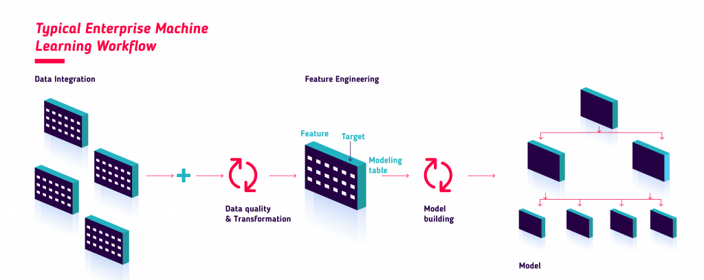

# Forecasting

El propósito de este análisis es predecir las ventas en número de transacciones (en un rango) de e-commerce de Elektra, a total  plataforma, diarias para una semana (de lunes a domingo), con cuatro días de anticipación (el jueves previo al primer día de predicción).

Teniendo este objetivo presente y una vez realizado el análisis descriptivo de la información, es factible proceder a crear y estructurar el conjunto de datos que servirá como insumo para realizar las predicciones.

El proceso de creación y estructuración de datos recibe el nombre de ingeniería de variables (feature engineering) y es la etapa en la que se crean nuevas características o atributos que contribuyen a la mejora de precisión en los pronósticos de ventas.

```{r workflow, echo=FALSE, fig.align='center', out.width='800pt', out.height='400pt'}

```

Es importante mencionar que **este proceso es iterativo** y no lineal. Una vez que se crean nuevas variables que potencialmente pueden mejorar la calidad predictiva del modelo, se realizan pruebas de precisión y calidad que permiten cuantificar el efecto de cada una de las variables incluidas en el modelo. Dependiendo de si la precisión aumenta, disminuye o se mantiene después de haber hecho cambios en las variables, se debe tomar la decisión de continuar aumentando variables, eliminar algunas o terminar el proceso con las actuales.

En las siguientes secciones se especifican los pasos a seguir para la construcción del modelo de aprendizaje estadístico automatizado.

## Ingeniería de variables

Para crear un modelo que permita obtener las mejores predicciones posibles, es necesario explotar la información disponible que permita encontrar los patrones relevantes de predicción. Dichos patrones pueden encontrarse en los datos históricos, sin embargo, también existen otras formas de encontrar variables importantes de predicción mediante:

* Transformación de las variables originales

* Creación de nuevas variables a partir de combinación de las originales 

* Análisis de datos anteriores (lags 1 día, 7 días, 1 año, etc)

* Datos externos (economía local, análisis de la competencia, etc)

A partir del análisis de las nuevas variables, será posible definir un conjunto de datos que permita realizar los pronósticos a lo largo del tiempo.

### Variables temporales 

Las variables temporales permiten asociar nueva información que se encuentra implícita en las fechas, por lo que naturalmente son las primeras que deben considerarse, entre ellas se encuentran:

* Día de la semana

* Mes del año

* Año

* Fechas festivas

* etc

Un caso particular de interés en la ingeniería de datos temporales, es considerar los lags-temporales de días, semanas e incluso años. Debido a la estacionalidad en las ventas, las transacciones ocurridas 1 a 15 días antes, así como las ventas del año pasado pueden servir para predecir las transacciones actuales. El siguiente gráfico muestra las transacciones a lo largo del tiempo, así como las ocurridas el año anterior:

```{r, include = FALSE}
knitr::opts_chunk$set(
  echo = FALSE, 
  fig.pos = 'H', 
  warning = FALSE,
  message = FALSE
  )
options(tinytex.verbose = TRUE)
options(Encoding='UTF-8')
```

```{r}
library(tidyverse)
library(corrplot)
library(heatmaply)
library(fpp3)
library(tsibble)
library(DataExplorer)
library(forecast)
library(skimr)
library(kableExtra)
library(lubridate)

library(tidymodels)
library(workflowsets)
library(timetk)
library(modeltime)
library(sknifedatar)
library(gt)
library(sknifedatar)
library(ranger)

ts_full_data <- readRDS("data/ts_full_data.rds")

ts_full_data %>% 
  mutate(
    dia_semana = wday(fecha, label = T, abbr = F),
    mes = month(fecha, label = T, abbr = F),
    anio = year(fecha)) %>% 
  relocate(dia_semana, .after = fecha) %>% 
  relocate(mes, .after = dia_semana) %>% 
  relocate(anio, .after = mes) %>% 
  select(fecha, dia_semana, mes, anio, transacciones = gtics_transacciones) %>% 
  mutate(yoy =  fecha - as.period(dweeks(52))) %>% 
  left_join(
    ts_full_data %>% select(fecha, yoy_transacciones = gtics_transacciones),
    by = c("yoy" = "fecha")
  ) %>% 
  arrange(desc(fecha)) %>% 
  filter(fecha >= '2021-05-01') %>% 
  pivot_longer(cols = matches("transacciones"), names_to = "Año", values_to = "transacciones") %>% 
  mutate(`Año` = case_when(
    `Año` == "transacciones" ~ "Actual",
    TRUE ~ "Anterior"
  )) %>% 
  ggplot(aes(x = fecha, y = transacciones, colour = `Año`)) +
  geom_line() + 
  scale_x_date(date_breaks = "1 month") +
  theme(axis.text.x = element_text(angle = 90, vjust = 0.5, hjust=1)) +
  ggtitle("Comparación con transacciones de año previo (Rho=0.42)")
```

Al calcular la correlación entre las ventas actuales y las ocurridas el año pasado, se reporta una correlación de 0.42, lo que sugiere que sí existe una mediana correlación con las transacciones del año anterior.


```{r, eval=FALSE}
library(zoo)

ts_full_data %>% 
  mutate(gtics_transacciones_mean7 =  zoo::rollmean(gtics_transacciones, k = 7, fill = NA, align = "right")) %>% 
  relocate(gtics_transacciones_mean7, .after = fecha) %>% 
  relocate(gtics_transacciones, .after = fecha) %>% 
  filter(fecha >= '2021-01-01') %>% 
  select(fecha, gtics_transacciones, gtics_transacciones_mean7) %>% 
  ggplot(aes(x = fecha)) +
  geom_line(aes(y = gtics_transacciones, colour = "Real")) +
  geom_line(aes(y = gtics_transacciones_mean7, colour = "Media móvil")) +
  scale_color_manual(name = "", values=c("Media móvil" = "blue", "Real" = "darkgray")) +
  ggtitle("Cálculo de media móvil") +
  ylab("Transacciones") + xlab("Fecha") +
  theme_classic()
```


## Partición

El proceso para desarrollar un modelo predictivo implica necesariamente particionar la información de modo que un porcentaje sea usado para su la detección de comportamiento y patrones relevantes para la predicción y el resto de la información sea usado para realizar predicciones. A estas particiones se les conoce como partición de entrenamiento (training) y de prueba (testing). En este segundo conjunto sí se conoce la respuesta a predecir, pero no se usa en el entrenamiento. Su uso es mediante *backtesting*. Se realizan los pronósticos sobre el periodo de tiempo disponible y posteriormente se comparan las predicciones con el valor real para determinar el mejor modelo a seleccionar y estimar el error futuro. 

```{r}
model_data <- ts_full_data %>% 
  select(fecha, transacciones = gtics_transacciones, gtics_usuarios,
         contains("costo")) %>% 
  mutate(yoy =  fecha - as.period(dweeks(52))) %>% 
  left_join(
    ts_full_data %>% select(fecha, yoy_transacciones = gtics_transacciones),
    by = c("yoy" = "fecha")
  ) %>% 
  as_tibble()

model_data %>% 
  as_tibble() %>% 
  initial_time_split(prop = 0.9) %>% 
  tk_time_series_cv_plan() %>% 
  plot_time_series_cv_plan(fecha, transacciones)
```
En el gráfico anterior se presenta la partición del conjunto de información disponible. A esta partición le corresponde el 90% a entrenamiento y el resto a prueba.

## Ajuste de modelos

Realizando la ingeniería de variables para crear características de interés que pueden aportar valor a la predicción, se muestra a continuación el conjunto de variables que son usadas como insumo para los modelos predictivos.

```{r}
model_data2 <- model_data %>% 
  mutate(
    transacciones = log(transacciones),
    festivo = case_when(
      (month(fecha) == 5) & (between(day(fecha), 1, 20)) ~ "Sí",
      between(fecha, as_date("2020-11-09"), as_date('2020-11-20')) ~ "Sí",
      between(fecha, as_date("2021-11-10"), as_date('2021-11-16')) ~ "Sí",
      between(fecha, as_date("2020-11-25"), as_date('2020-11-30')) ~ "Sí",
      between(fecha, as_date("2021-11-25"), as_date('2021-11-30')) ~ "Sí",
      between(fecha, as_date("2020-07-12"), as_date('2020-07-25')) ~ "Sí",
      between(fecha, as_date("2021-07-12"), as_date('2021-07-25')) ~ "Sí",
      between(fecha, as_date("2021-03-24"), as_date('2021-03-28')) ~ "Sí",
      between(fecha, as_date("2022-03-24"), as_date('2022-03-28')) ~ "Sí",
      TRUE ~ "No")
  )

recipe_time <- model_data2 %>% 
  recipe(transacciones ~ fecha, data = .) %>%
  step_date(fecha, features = c('dow','quarter', 'month', 'semester')) %>% 
  step_lag(transacciones, lag = 365) %>% 
  step_fourier(fecha, period = 365/12, K = 5)


# step_box_cox
# 

recipe_base <- model_data2 %>% 
  recipe(transacciones~., data=.) %>%
  step_date(fecha, features = c('dow', 'month')) %>% 
  step_lag(transacciones, lag = 10:14) %>% 
  #step_lag(gtics_usuarios, lag = 10:14) %>% 
  #step_lag(gtics_sesiones, lag = 10:14) %>% 
  step_fourier(fecha, period = 365/12, K = 10) %>% 
  step_mutate(
    yoy_transacciones = log(yoy_transacciones)
    ) %>% 
  step_dummy(fecha_dow, fecha_month) %>% 
  step_dummy(festivo) %>% 
  step_interact(~starts_with("fecha_dow"):yoy_transacciones) %>% 
  step_interact(~starts_with("festivo"):yoy_transacciones) %>% 
  #step_interact(~contains("fecha_dow_"):gtics_usuarios) %>% 
  step_interact(~festivo_Sí:gtics_usuarios) %>% 
  step_interact(~festivo_Sí:fb_costo_link_clicks) %>% 
  step_interact(~festivo_Sí:gads_costo_buscar) %>% 
  step_interact(~festivo_Sí:fb_costo_reach) %>% 
  step_interact(~festivo_Sí:gads_costo_display) %>% 
  step_interact(~festivo_Sí:gads_costo_vídeo) %>% 
  step_interact(~fecha_dow_lun:fb_costo_link_clicks) %>%
  step_interact(~fecha_dow_mar:fb_costo_link_clicks) %>%
  step_interact(~fecha_dow_mié:fb_costo_link_clicks) %>%
  step_interact(~fecha_dow_jue:fb_costo_link_clicks) %>%
  step_interact(~fecha_dow_vie:fb_costo_link_clicks) %>%
  step_interact(~fecha_dow_sáb:fb_costo_link_clicks) %>%
  step_rm(yoy) %>% 
  step_filter(fecha >= '2021-10-31') %>% 
  step_ts_impute(all_numeric_predictors(), period=365) 
  
juice(prep(recipe_base)) %>% 
  relocate(transacciones, .after = fecha) %>% 
  glimpse()
```

Los modelos que serán ajustados y posteriormente comparados en su desempeño son:

* Modelo SARIMA con errores boosting

* Modelo Prophet con errores boosting

* Modelo Prophet con error de tendencia logística boosting

* Modelo multivariado adaptativo con splines de regresión (MARS)

* Red neuronal artificial autoregresiva (NNETAR)

Estos 5 modelos se ponen a prueba, mostrando los siguientes resultados en el periodo de prueba.

```{r}
auto_arima_boost <- arima_boost(
  mode = "regression",
  seasonal_period = "1 weeks"
) %>% 
  set_engine('auto_arima_xgboost')

prophet_boost <- prophet_boost(
  mode = 'regression',
  seasonality_yearly = TRUE,
  seasonality_weekly = TRUE,
  trees = 5000) %>% 
  set_engine("prophet_xgboost")

# prophet_xgboost logistic
prophet_boost_log <- prophet_boost(
    mode = 'regression',
    logistic_floor = min(model_data2$transacciones),
    logistic_cap = max(model_data2$transacciones),
    growth = 'logistic',
    seasonality_yearly = TRUE,
    seasonality_weekly = TRUE,
  ) %>%
  set_engine("prophet_xgboost")

# mars
mars <- mars( mode = 'regression') %>% 
  set_engine('earth')

# nnetar
nnetar <- nnetar_reg(
  seasonal_period = "1 weeks"
) %>% 
  set_engine("nnetar")

elasticnet <- linear_reg(
  mode = "regression",
  engine = "glmnet",
  mixture = 0.5,
  penalty = 0.0001
)

rf_model <- rand_forest(
  mode = "regression",
  mtry = 6,
  min_n = 7,
  trees = 5000,
  engine = "ranger"
)

```

```{r}
split_data <- model_data2 %>% initial_time_split(prop = 0.9)
training_data <- training(split_data)
testing_data <- testing(split_data)

tscv_data <- time_series_cv(
  data = training_data,
  date_var = fecha,
  initial = "13 months",
  assess = "1 months",
  skip = "1 months",
  cumulative = TRUE,
  slice_limit = 6
  ) 

tscv_data %>% 
  tk_time_series_cv_plan() %>% 
  plot_time_series_cv_plan(fecha, transacciones)

```

```{r}
wfsets <- workflow_set(
  preproc = list(
    base                = recipe_base
  ),
  models  = list(
    M_arima_boost       = auto_arima_boost,
    M_prophet_boost     = prophet_boost,
    M_prophet_boost_log = prophet_boost_log,
    M_mars              = mars,
    M_nnetar            = nnetar,
    M_random_forest     = rf_model
  ),
  cross   = TRUE
) 
#wfsets
```


```{r}
set.seed(1234)

split_prop <- 0.9
wffits <- modeltime_wfs_fit(
  .wfsets = wfsets, 
  .split_prop = split_prop, 
  .serie=model_data2
  )
```


```{r, out.width="600pt"}
modeltime_wfs_forecast(
  .wfs_results = wffits, 
  .serie = model_data2, 
  .split_prop=split_prop) %>% 
  mutate(
    .value = exp(.value),
    .conf_lo = exp(.conf_lo),
    .conf_hi = exp(.conf_hi),
  ) %>% 
  plot_modeltime_forecast(
    .conf_interval_show = FALSE,
    .conf_interval_alpha = 0.05,
    .plotly_slider = T
  )
```

```{r}
ranking <- modeltime_wfs_rank(wffits, rank_metric = "mape", minimize = T)

wffits %>%
  select(-.fit_model, -.model_desc, -.type) %>% 
  separate(.model_id, c('recipe', 'model'), sep='_M_', remove=FALSE) %>% 
  select(-.model_id) %>% 
  arrange(rmse) %>% 
  mutate_if(is.numeric, round, digits = 2) %>% 
  relocate(recipe, .after = model) %>% 
  gt() %>% 
  tab_header(title='Evaluación de modelos')
```


## Selección de mejor modelo

Al conocer las métricas de desempeño de cada uno de los modelos, es posible discernir cuáles de ellos tienen mayor potencial y deben ser ajustados con mayor precisión. Una segunda iteración de ajuste de modelos y estimación de error con intervalos de confianza al 95% sobre el conjunto de pruebas arroja los siguientes resultados


```{r}
wffits_best <- modeltime_wfs_bestmodel(
  .wfs_results = ranking, 
  .model = "top 2", 
  .metric = "mape", 
  .minimize = TRUE
  )
```

```{r, out.width="600pt"}
modeltime_wfs_forecast(.wfs_results = wffits_best, .serie = model_data2, .split_prop=split_prop)  %>% 
  mutate(
    .value = exp(.value),
    .conf_lo = exp(.conf_lo),
    .conf_hi = exp(.conf_hi),
  ) %>% 
  plot_modeltime_forecast(
    .interactive = TRUE,
    .conf_interval_alpha = 0.1,
    .plotly_slider = T
    )
```

```{r}
pred <- modeltime_wfs_forecast(
  .wfs_results = wffits_best, 
  .serie = model_data2, 
  .split_prop = split_prop)  %>% 
  mutate(
    .value = exp(.value),
    .conf_lo = exp(.conf_lo),
    .conf_hi = exp(.conf_hi),
  ) 

multi_metric <- metric_set(rmse, rsq, mae, mape, smape, mase)

model_data2 %>% select(fecha, transacciones) %>% 
  left_join(
    pred %>% select(fecha = .index, .pred = .value, .model_id)
  ) %>% 
  mutate(transacciones = exp(transacciones)) %>% 
  filter(fecha >= '2022-03-16', !is.na(.model_id)) %>%
  group_by(.model_id) %>% 
  multi_metric(truth = transacciones, estimate = .pred) %>% 
  separate(.model_id, c('recipe', 'model'), sep='_M_', remove=FALSE) %>% 
  mutate(
    model = str_remove(model, "base_M_"),
    .estimate = round(.estimate, 2)) %>% 
  select(-.model_id, -.estimator) %>%
  relocate(recipe, .after = model) %>% 
  pivot_wider(names_from = .metric, values_from = .estimate) %>% 
  arrange(rmse) %>% 
  select(model, recipe, mae, mape, mase, smape,	rmse, rsq) %>% 
  gt() %>% 
  tab_header(title='Evaluación final de modelos')
  
```

