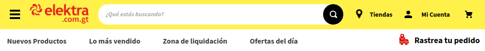

--- 
title: "Elektra: Forecasting DEMO"
subtitle: "Análisis Exploratorio de Datos"
site: bookdown::bookdown_site
documentclass: book
bibliography: [book.bib, packages.bib]
biblio-style: apalike
link-citations: yes
always_allow_html: true
toctitle: "**Contenido**"
header-includes:
  \renewcommand{\contentsname}{Contenido}
  \usepackage{caption}
  \captionsetup[figure]{name=Figura}
  \setlength\headheight{12.80502pt}
  \usepackage{float}
---

```{r setup, include = FALSE}
knitr::opts_chunk$set(
  echo = FALSE, 
  fig.pos = 'H', 
  warning = FALSE,
  message = FALSE
  )
options(tinytex.verbose = TRUE)
options(Encoding='UTF-8')
```

# Introducción {-}

Este documento presenta los hallazgos iniciales en los datos usados para realizar el **DEMO** de pronósticos de ventas de *Elektra* a través de la plataforma de e-commerce. La documentación es creada a partir de los archivos entregados por parte de *DDI*. En este análisis se realiza una inspección minuciosa a cada uno de los atributos y eventos asociados a las actividades de marketing y ventas diarias que ocurren a través de la plataforma de Elektra Gt.

```{r ecommerce, echo=FALSE, fig.align='center', out.width='650pt', out.height='75pt'}

```

```{r portada, echo=FALSE, fig.align='center', out.width='700pt', out.height='250pt'}
knitr::include_graphics("img/00-intro/forecasting.jpeg")
```

## Objetivo {-}

Los insumos entregados por parte de *DDI* tienen la finalidad de ser usados para desarrollar las actividades que se han planteado en el objetivo del proyecto, las cuales se enlistan a continuación:

1. **Predicción:** predecir las ventas (en un rango) de e-commerce de Elektra, a total  plataforma, diarias para una semana (de lunes a domingo), con cuatro días de anticipación (el jueves previo al primer día de predicción). 

2. **Data Storytelling:** producir insights sobre las ventas y las variables que afectan a éstas mediante gráficas comparativas multivariadas.

3. **Machine Learning:** Automatizar el pipeline de ingesta y procesamiento de datos y de ejecución del modelo de predicción  de ventas sobre la infraestructura (Data Warehouse) de *DDI*.

## Alcances {-}

La implementación del proyecto completo ha sido dividido en tres fases "Demo, Desarrollo y Producción". **El contendio de esta fase corresponde exclusivamente al desarrollo del Demo,** el cual incluye las siguientes actividades:

* En esta etapa se desarrollará una demo que sirva como instrumento con fines de marketing para demostrar las capacidades y alcances de un proyecto de predicción de ventas.

* El desarrollo será en una computadora local, es decir: los datos serán consumidos como tablas planas entregadas por DDI; el modelo no se ejecutará de manera automática ni será puesto en producción sobre ninguna infraestructura.

* El tiempo para curar datos (procesar, limpiar, pegar) estará limitado, de manera que si los datos no son de buena calidad o fáciles de procesar serán descartados y retomados en las siguientes fases.

* Se probarán un máximo de 2 metodologías, con especificaciones limitadas para cada una.

* Las variables explicativas a incluir estarán limitadas. 

* Podrá visualizarse a través de un dashboard de prueba limitado a 20 hrs al mes, donde se permita al usuario consultar las predicciones.

___

::: {.infobox .note data-latex="{note}"}
**Importante:**

Antes de llevar a cabo las actividades, es indispensable conocer el contenido y calidad asociada a cada uno de los atributos incluidos en los archivos entregados para el desarrollado el DEMO. Dicho análisis de contenido y calidad es presentado en el actual documento.
:::

```{r include=FALSE}
# automatically create a bib database for R packages
knitr::write_bib(
  c(.packages(), 'bookdown', 'knitr', 'rmarkdown'), 
  'packages.bib')
```
